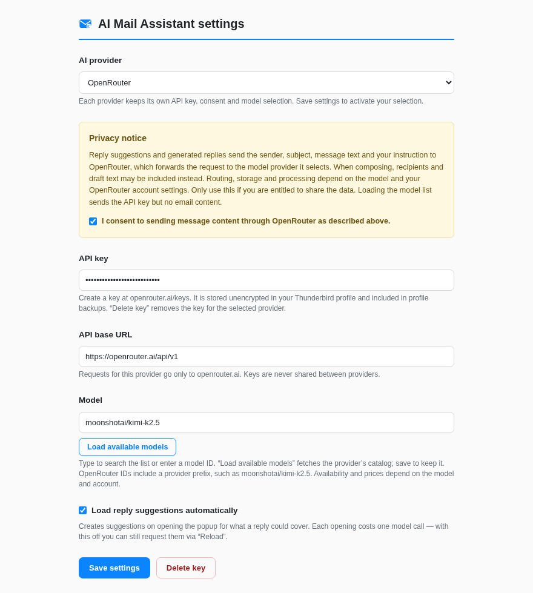
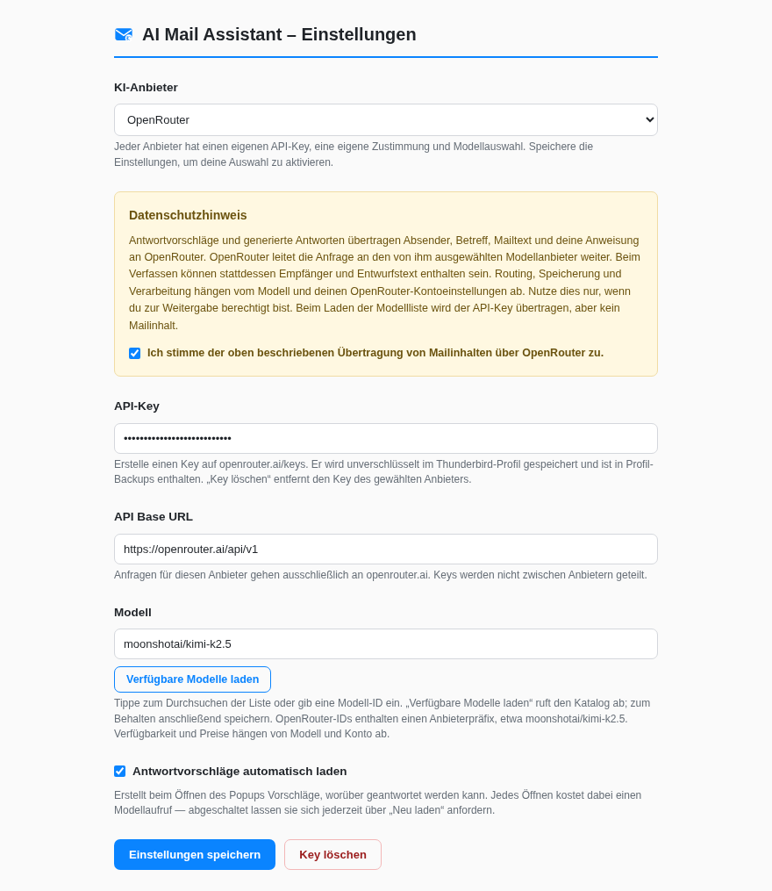

<p align="center">
  
</p>
<p align="center">
  <a href="https://github.com/goarstne/ai-mail-assistant/actions/workflows/ci.yml"></a>
  
  
  
  
</p>
<p align="center"><b>English</b> · <a href="#deutsch">Deutsch</a></p>

A Thunderbird extension that drafts email replies with **OpenRouter** or
**Kimi / Moonshot AI**. Formerly **Kimi AI Mail Assistant**.

Read a message, choose a suggested reply topic, and get a draft in a compose
window. You can also give your own instruction or write into an existing draft.
Replies follow the language of the original email.

<p align="center">
  
  
</p>

## Providers

| Provider | API endpoint | API key |
|---|---|---|
| Kimi / Moonshot AI | `https://api.moonshot.ai/v1` | [International platform](https://platform.kimi.ai/console/api-keys) |
| Kimi / Moonshot AI (China) | `https://api.moonshot.cn/v1` | [China platform](https://platform.moonshot.cn/) |
| OpenRouter | `https://openrouter.ai/api/v1` | [OpenRouter keys](https://openrouter.ai/keys) |

Each provider has its own key, consent, selected model and cached model list.
Switching providers never copies a key or consent to another endpoint. Save to
activate the selected provider. Existing 1.x Kimi settings are retained for the
same endpoint when you upgrade.

**OpenRouter:** choose “Load available models”, then type to search the model
list or enter a full model ID, such as `moonshotai/kimi-k2.5`. Variant suffixes
such as `:free` are supported. The fallback `openrouter/auto` lets OpenRouter
choose the model. Model availability and charges depend on your account.
Catalog context and completion limits are used to size requests; unknown router
models use a conservative 8K context budget until their metadata is loaded and
saved. See the [OpenRouter models documentation](https://openrouter.ai/docs/guides/overview/models).

<p align="center">
  
</p>

## Install or update

Download the `.xpi` from [Releases](https://github.com/goarstne/ai-mail-assistant/releases/latest).
In Thunderbird: **Tools → Add-ons and Themes → gear icon → Install Add-on From File…**.

1. Select your provider.
2. Enter its API key, choose a model and confirm the provider's privacy notice.
3. Save settings and grant Thunderbird access to the selected API.

The internal add-on ID is unchanged, so this updates the existing Kimi extension
and keeps its stored settings. You do not need to uninstall it first.

## Features

- **Reply topics:** distinct directions tied to the email, such as accepting,
  declining or asking for more information. A click writes the reply.
- **Compose support:** draft a new message or extend an existing draft; replies
  use the original message as context when Thunderbird provides it.
- **Plain text and HTML:** inserts text correctly in either compose mode and
  preserves existing draft content.
- **Mail parsing:** prefers plain text, skips attachments and retains paragraph
  breaks when converting HTML. Unreadable or encrypted messages are handled explicitly.
- **Background requests:** generation continues if the popup closes.
- **Provider-specific requests:** Kimi keeps its model-specific parameters;
  OpenRouter uses its normalized chat API and catalog limits.
- **Clear failures:** missing permissions, rejected keys, insufficient credit,
  rate limiting and timeouts. Incomplete output is not inserted into a draft.
- **German and English**, dark mode, keyboard navigation and accessible labels.
- **No runtime dependencies.**

<p align="center">
  
</p>

## Privacy

Reply suggestions and generated text send email or draft content to the selected
service. **OpenRouter forwards the request to an upstream model provider.**
Consent is stored separately for each service. Loading the model catalog sends
only an API key, not email content; it is a separate user-triggered action.

Automatic suggestions cost one model request whenever you open the popup. Turn
them off in settings if you prefer to request suggestions manually.

Keys are stored **unencrypted** in Thunderbird's local extension storage. Delete
a provider's key or withdraw its consent in settings. Endpoint allowlisting and
blocked redirects prevent requests from being silently redirected to another
host. Mail content is treated as untrusted input in prompts, using delimiter
escaping and a random nonce. These precautions do not guarantee that a model
will always follow instructions.

See [PRIVACY.md](PRIVACY.md) for transmitted fields, storage and recipients.
There is no extension telemetry or analytics.

## Development

```bash
npm run check   # consistency checks and 93 tests, no dependency install needed
npm run build   # dist/ai-mail-assistant-1.8.0.xpi
npm install
npm run lint
npm run preview # interactive UI with synthetic data and no real API requests
npm run shots   # refresh screenshots using Chrome/Chromium
```

The tests cover configuration migration, provider isolation, request construction,
model discovery, background reply/compose/suggestion flows and error handling
with mocked Thunderbird and network APIs. A live authenticated completion is
not part of the automated suite. See [development notes](docs/DEVELOPMENT.md).

## License

MIT

---
<a id="deutsch"></a>

# Deutsch

**AI Mail Assistant** formuliert E-Mail-Antworten in Thunderbird mit
**OpenRouter** oder **Kimi / Moonshot AI**. Die Erweiterung hieß bisher
**Kimi AI Mail Assistant**.

Sie liest die Nachricht und schlägt Antwortrichtungen vor: etwa zusagen,
ablehnen oder nachfragen. Ein Klick schreibt die Antwort in ein
Verfassen-Fenster. Eigene Anweisungen, neue Nachrichten und bestehende Entwürfe
werden ebenfalls unterstützt. Die Antwort folgt der Sprache der Originalmail.

<p align="center">
  
  
</p>

## Installation und Einrichtung

Die `.xpi` aus den [Releases](https://github.com/goarstne/ai-mail-assistant/releases/latest) laden.
In Thunderbird: **Extras → Add-ons und Themes → Zahnrad → Add-on aus Datei installieren…**.

1. Anbieter wählen: Kimi international, Kimi China oder OpenRouter.
2. Den zugehörigen API-Key eintragen, Modell auswählen und dem
   anbieterspezifischen Datenschutzhinweis zustimmen.
3. Speichern und Thunderbird den Zugriff auf die gewählte API erlauben.

Bestehende Kimi-Einstellungen bleiben beim Update erhalten. Die interne Add-on-ID
bleibt gleich; eine Deinstallation ist nicht nötig.

Jeder Anbieter speichert seinen eigenen Key, seine Zustimmung und Modellauswahl.
Ein Wechsel überträgt diese Angaben nicht an einen anderen Anbieter. Die Auswahl
wird erst durch Speichern aktiv.

## OpenRouter

Einen Key auf [openrouter.ai/keys](https://openrouter.ai/keys) erstellen.
**„Verfügbare Modelle laden“** ruft den Katalog ab. Tippen durchsucht die Liste;
du kannst auch eine vollständige Modell-ID wie `moonshotai/kimi-k2.5` eingeben.
Varianten mit `:free` werden unterstützt. `openrouter/auto` überlässt OpenRouter
die Modellauswahl. Verfügbarkeit und Kosten hängen vom Konto und Modell ab.

Die Kontext- und Ausgabelimits aus dem Katalog werden beim Begrenzen der Anfragen
berücksichtigt. Für unbekannte OpenRouter-Modelle gilt bis zum Laden und Speichern
der Metadaten ein vorsichtiges Kontextbudget von 8K Token.

<p align="center">
  
</p>

## Datenschutz und Grenzen

Antwortvorschläge und generierte Texte übertragen Mail- oder Entwurfsinhalte an
den gewählten Dienst. **OpenRouter leitet die Anfrage an einen Modellanbieter
weiter.** Die Zustimmung wird für jeden Dienst separat gespeichert. Das manuelle
Laden der Modellliste überträgt den API-Key, aber keine Mailinhalte.

Automatische Vorschläge kosten beim Öffnen des Popups einen Modellaufruf. Du
kannst sie abschalten und bei Bedarf über „Neu laden“ anfordern.

Keys liegen **unverschlüsselt** im Thunderbird-Profil. „Key löschen“ entfernt den
Key des ausgewählten Anbieters und zieht dessen Zustimmung zurück. Mehr zu den
übertragenen Daten steht in [PRIVACY.md](PRIVACY.md).

Anhänge werden nicht gelesen. Es gibt kein Streaming. Bei abgebrochener oder
unvollständiger Modellausgabe wird kein Text eingefügt. Modellantworten sollten
vor dem Versenden geprüft werden; die Erweiterung verschickt selbst keine Mail.
Die Erweiterung enthält keine Telemetrie oder Analytics.

## Entwicklung

`npm run check` prüft Konsistenz und 93 Tests. `npm run build` erzeugt eine
installierbare `.xpi`. `npm run preview` bietet eine Oberfläche mit erfundenen
Beispieldaten und simulierten API-Antworten. Die Live-Anbindung mit einem echten
API-Key ist nicht Teil der automatischen Tests.

Details: [Entwicklungsdokumentation](docs/DEVELOPMENT.md).

## Lizenz

MIT
