<p align="center">
  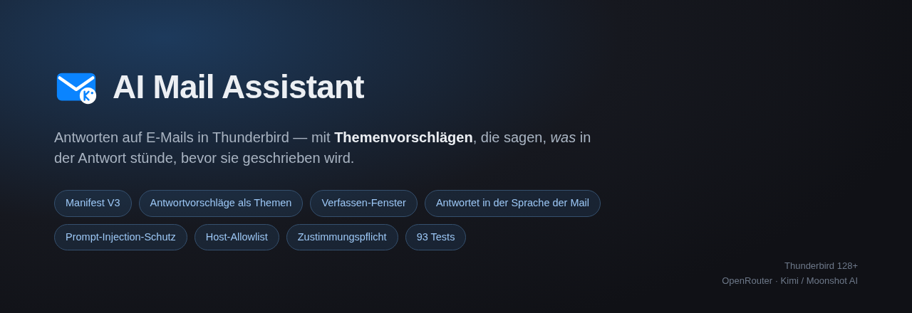
</p>

<p align="center">
  <a href="https://github.com/goarstne/kimi-ai-mail-assistant/actions/workflows/ci.yml"></a>
  
  
  
  
  
</p>

<p align="center">
  <b>English</b> · <a href="#deutsch">Deutsch</a>
</p>

---

A Thunderbird MailExtension that drafts email replies with **Kimi AI** (Moonshot AI).

Most AI mail assistants hand you a blank prompt box and expect you to know what
you want to say. This one reads the message first and offers you **topics** —
short descriptions of *what each reply would actually contain*. Pick one, and the
reply is written and dropped into a compose window.

<p align="center">
  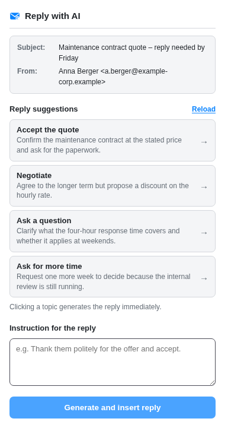
  &nbsp;&nbsp;
  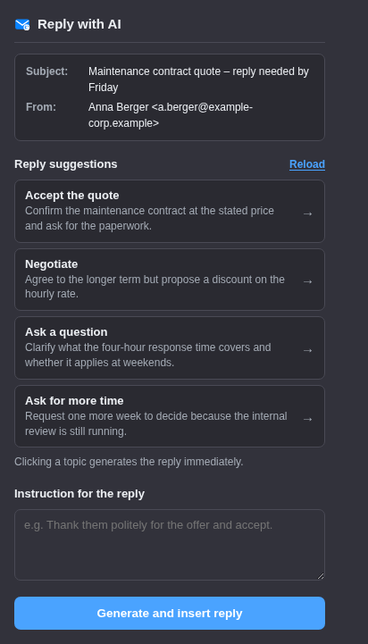
</p>

<p align="center"><i>Reply suggestions — light and dark. One click writes the reply.</i></p>

## What it does

**Suggests reply topics, not just text.** Three to four deliberately different
directions — accept, decline, ask a question, request more time — each with a
title and one sentence describing what that reply would say, tied to the actual
content of the message. A pointless direction is not invented: for a pure
newsletter you get one or two suggestions, not four.

**Writes in the language of the email.** An English message gets an English
reply, even when your instruction is in German. Enforced three ways: as rule one
of the system prompt, as a reminder at the end of the prompt, and by having the
suggestions phrase their own instruction in the message's language.

**Works while composing, too.** A second button in the compose window writes into
the draft you already have open — for a fresh message or a reply you started by
hand. For a reply it reads the original message properly instead of the mangled
quoted text in the draft.

<p align="center">
  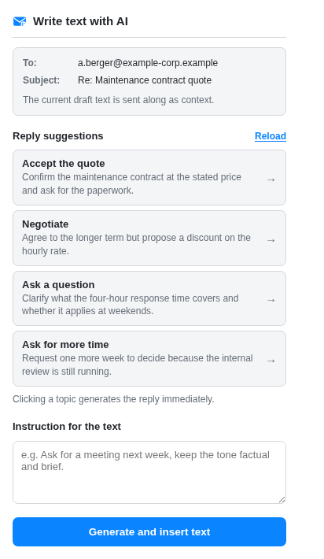
</p>

### Everything else

| | |
|---|---|
| **Plain text and HTML** | Detects whether the compose window is plain text and writes accordingly — no stray `undefined` in your mail. |
| **Reads mail properly** | Picks `text/plain` over `text/html` by content type, skips attachments, and preserves paragraph breaks when converting HTML — no `HelloWorld` run-together text. |
| **Sensible truncation** | Long messages are cut at a word boundary, with a budget derived from the model's context window, and the model is told the text was shortened. |
| **Live model list** | "Load available models" queries `/v1/models` and shows exactly what your account has access to. No hard-coded list to go stale. |
| **Model-aware requests** | `moonshot-v1` gets `temperature` and `max_tokens`; `kimi-k2.x` and `kimi-k3` get `max_completion_tokens`, and K3 additionally `reasoning_effort`. Sending the wrong parameter is an instant HTTP 400. |
| **Survives a closing popup** | The API call and the compose step run in the background script. Clicking away mid-request no longer silently kills the reply. |
| **Clear failures** | Separate messages for a rejected key, rate limiting, network trouble and a 60-second timeout — not one generic error. |
| **German and English UI** | Full `_locales` catalogues, 84 strings. |
| **Dark mode, keyboard, screen readers** | Follows the system theme, visible focus rings, accessible names on every suggestion card, respects reduced-motion. |

## Security and privacy

This extension sends the content of your email to a third party. It is built to
be honest about that rather than quiet.

**Consent is required before anything is transmitted.** No key, no tick in the
box — no request leaves your machine. The background script refuses the job
before building a prompt. Consent can be withdrawn, and the key deleted, at any
time.

<p align="center">
  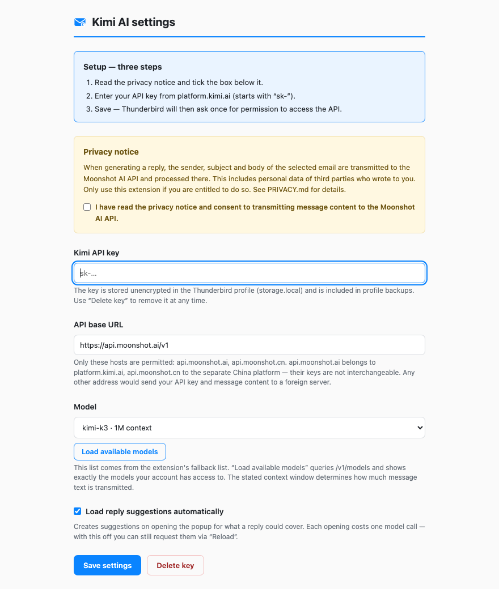
</p>

**Prompt injection is treated as a real threat.** Anyone can email you, so the
message body is untrusted input. Two independent barriers:

1. **Escaping.** `<` and `>` are masked in sender, subject, body and instruction.
   Since the prompt's own delimiters use angle brackets, it follows that the
   untrusted portion contains no `<` at all and cannot open or close an element.
   A test asserts exactly this invariant.
2. **A per-request nonce.** `<email_content id="…">` carries a random id from
   `crypto.getRandomValues`. Even given a hole in the first barrier, an attacker
   does not know it.

The rules in the system prompt sit on top of that — they are a request to the
model, not a mechanism, and they do not carry the defence alone.

**The endpoint is on an allowlist.** Only `api.moonshot.ai` and
`api.moonshot.cn` are accepted, checked against the parsed hostname — a
suffix comparison would be defeated by `api.moonshot.cn.attacker.example`. URLs
with embedded credentials are rejected.

**No telemetry, no analytics, no third server.** See [PRIVACY.md](PRIVACY.md)
for exactly which fields are transmitted, to whom, and what is stored locally.

> **Note on GDPR:** the messages you reply to normally contain personal data of
> third parties who know nothing about this transmission. In a business context
> that needs a legal basis. [PRIVACY.md](PRIVACY.md) spells this out.

## Install

Download the `.xpi` from [Releases](../../releases/latest), then in Thunderbird:
**Tools → Add-ons and Themes → gear icon → "Install Add-on From File…"**.

Or build it yourself:

```bash
npm run build
```

The setup page opens by itself when a key or consent is missing. You need an API
key from [platform.kimi.ai](https://platform.kimi.ai/console/api-keys).

<p align="center">
  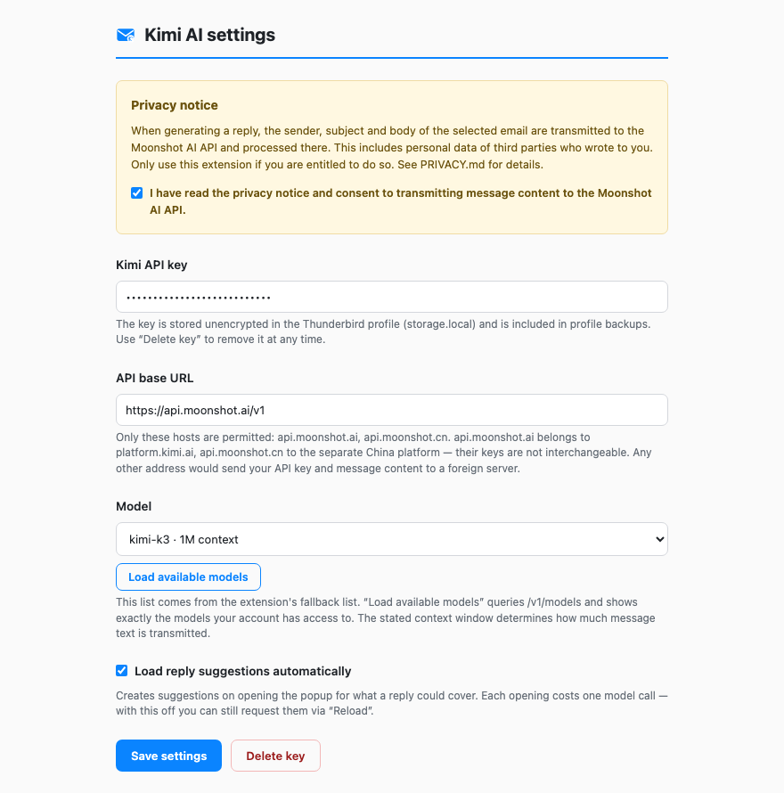
</p>

## Development

No runtime dependencies. Everything runs with plain Node.

```bash
npm run check
```

Runs the consistency checks (manifest valid, referenced files present, every
element id used by a script actually in its markup, every i18n key defined and
used in both languages) and 61 unit tests.

```bash
npm run preview
```

Renders the interface in a browser from the same HTML and CSS the add-on ships,
with a stubbed `browser` object. States you rarely see in normal use are
switchable from the address bar — missing consent, missing key, suggestions
loading or failing, a message with no readable text part, generation failing.
`npm run shots` turns those into the screenshots above.

More detail in [docs/DEVELOPMENT.md](docs/DEVELOPMENT.md); the full code audit
and the manual test checklist are in [docs/AUDIT.md](docs/AUDIT.md).

### Honest limitations

- One model call per click, no streaming.
- Attachments are not read.
- Encrypted messages yield no text part; the popup says so and disables the button.
- The context window of an unknown model is estimated from its id, not queried.
- The API key sits unencrypted in `storage.local` — Thunderbird offers extensions
  no protected key store, and a locally decryptable secret would be theatre.
- The DOM-dependent code paths and everything touching Thunderbird APIs are not
  covered by automated tests. The manual checklist in [docs/AUDIT.md](docs/AUDIT.md)
  exists for that reason.

## License

MIT

---

<a id="deutsch"></a>

# Deutsch

<p align="center">
  <a href="#">English</a> · <b>Deutsch</b>
</p>

Eine Thunderbird-MailExtension, die E-Mail-Antworten mit **Kimi AI**
(Moonshot AI) formuliert.

Die meisten KI-Mailhelfer geben dir ein leeres Eingabefeld und erwarten, dass du
weißt, was du sagen willst. Dieser liest erst die Nachricht und bietet dir
**Themen** an — kurze Beschreibungen dessen, *was in der jeweiligen Antwort
stünde*. Eines anklicken, und die Antwort wird geschrieben und in ein
Verfassen-Fenster gesetzt.

<p align="center">
  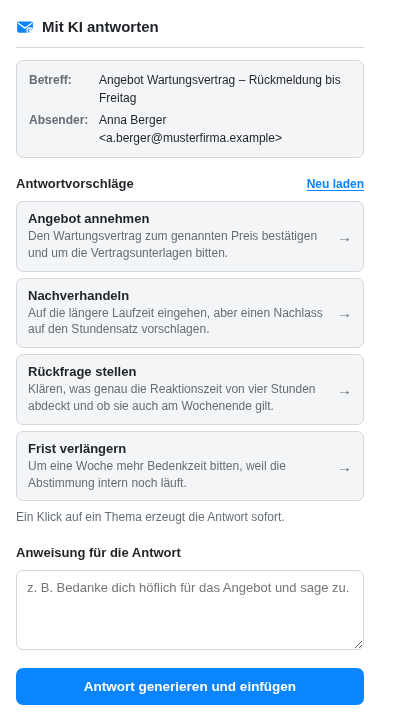
  &nbsp;&nbsp;
  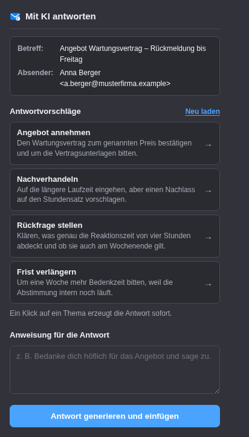
</p>

<p align="center"><i>Antwortvorschläge — hell und dunkel. Ein Klick schreibt die Antwort.</i></p>

## Was sie kann

**Schlägt Themen vor, nicht nur Text.** Drei bis vier bewusst verschiedene
Richtungen — zusagen, absagen, nachfragen, um Aufschub bitten — jede mit Titel
und einem Satz, der beschreibt, was diese Antwort sagen würde, bezogen auf den
tatsächlichen Inhalt. Sinnlose Richtungen werden nicht erfunden: Bei einem reinen
Newsletter bekommst du ein oder zwei Vorschläge, nicht vier.

**Antwortet in der Sprache der E-Mail.** Eine englische Nachricht bekommt eine
englische Antwort, auch wenn deine Anweisung deutsch ist. Dreifach abgesichert:
als Regel 1 im System-Prompt, als Erinnerung am Ende des Prompts, und dadurch,
dass die Vorschläge ihre Anweisung selbst in der Sprache der Mail formulieren.

**Funktioniert auch beim Verfassen.** Eine zweite Schaltfläche im
Verfassen-Fenster schreibt in den Entwurf, den du gerade offen hast — für eine
neue Mail wie für eine selbst begonnene Antwort. Bei einer Antwort liest sie die
Originalnachricht sauber aus, statt den durch die Zitatformatierung
verunstalteten Text im Entwurf.

<p align="center">
  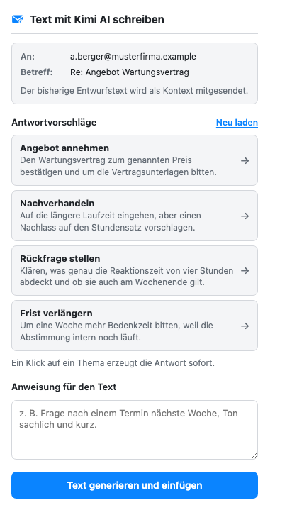
</p>

### Alles Weitere

| | |
|---|---|
| **Nur-Text und HTML** | Erkennt, ob das Verfassen-Fenster im Nur-Text-Modus ist, und schreibt entsprechend — kein verirrtes `undefined` in der Mail. |
| **Liest Mails richtig** | Wählt `text/plain` vor `text/html` anhand des Content-Type, überspringt Anhänge und erhält Absatzgrenzen beim Umwandeln von HTML — kein zusammengeklebtes `HalloWelt`. |
| **Sinnvolles Kürzen** | Lange Mails werden an einer Wortgrenze gekappt, mit einem Budget aus dem Kontextfenster des Modells, und dem Modell wird die Kürzung mitgeteilt. |
| **Modellliste von der API** | „Verfügbare Modelle laden" fragt `/v1/models` ab und zeigt genau das, was dein Account freigeschaltet hat. Keine fest verdrahtete Liste, die veraltet. |
| **Modellabhängige Parameter** | `moonshot-v1` bekommt `temperature` und `max_tokens`; `kimi-k2.x` und `kimi-k3` bekommen `max_completion_tokens`, K3 zusätzlich `reasoning_effort`. Der falsche Parameter ist ein sofortiger HTTP 400. |
| **Übersteht ein schließendes Popup** | API-Aufruf und Einfügen laufen im Hintergrundskript. Ein Klick daneben bricht die Antwort nicht mehr stillschweigend ab. |
| **Verständliche Fehler** | Getrennte Meldungen für abgelehnten Key, Ratenbegrenzung, Netzwerkprobleme und 60-Sekunden-Zeitüberschreitung — nicht ein Sammelfehler. |
| **Deutsche und englische Oberfläche** | Vollständige `_locales`-Kataloge, 84 Zeichenketten. |
| **Dunkler Modus, Tastatur, Screenreader** | Folgt dem Systemthema, sichtbare Fokusringe, zugängliche Namen auf jeder Vorschlagskarte, achtet auf `prefers-reduced-motion`. |

## Sicherheit und Datenschutz

Diese Erweiterung sendet den Inhalt deiner E-Mail an einen Dritten. Sie ist
darauf ausgelegt, das offen zu benennen statt es zu verschweigen.

**Ohne Zustimmung wird nichts übertragen.** Kein Key, kein Haken — keine Anfrage
verlässt den Rechner. Das Hintergrundskript lehnt den Auftrag ab, bevor
überhaupt ein Prompt gebaut wird. Zustimmung und Key lassen sich jederzeit
zurücknehmen.

<p align="center">
  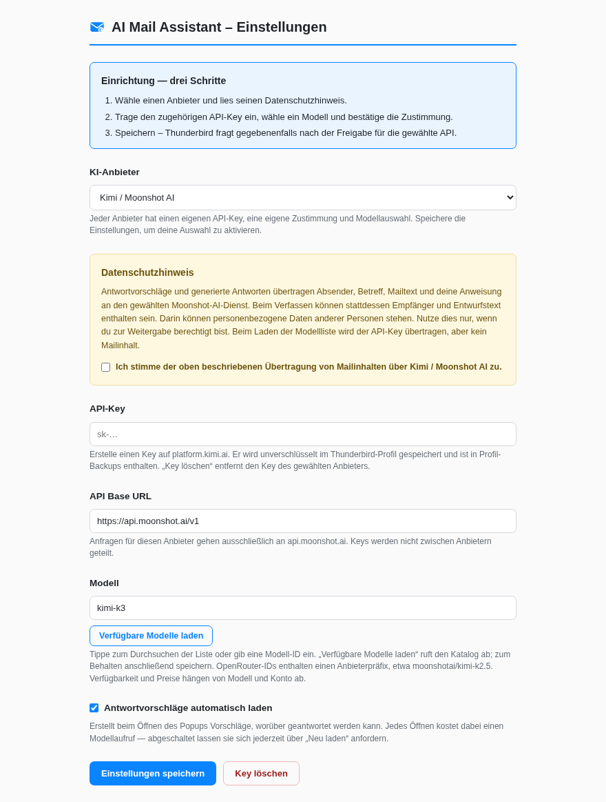
</p>

**Prompt Injection wird als echte Bedrohung behandelt.** Jeder kann dir
schreiben, der Mailinhalt ist also nicht vertrauenswürdig. Zwei unabhängige
Schranken:

1. **Maskierung.** `<` und `>` werden in Absender, Betreff, Inhalt und Anweisung
   maskiert. Da die Delimiter des Prompts selbst Winkelklammern benutzen, folgt
   daraus: der unvertraute Anteil enthält kein einziges `<` und kann kein Element
   öffnen oder schließen. Genau diese Invariante prüft ein Test.
2. **Ein Nonce pro Anfrage.** `<email_content id="…">` trägt eine zufällige
   Kennung aus `crypto.getRandomValues`. Selbst bei einer Lücke in Schranke 1
   kennt ein Angreifer sie nicht.

Die Regeln im System-Prompt kommen obendrauf — sie sind eine Bitte an das Modell,
kein Mechanismus, und tragen die Absicherung nicht allein.

**Der Endpunkt steht auf einer Allowlist.** Nur `api.moonshot.ai` und
`api.moonshot.cn` werden akzeptiert, geprüft am geparsten Hostnamen — ein
Suffix-Vergleich wäre durch `api.moonshot.cn.angreifer.example` auszuhebeln.
URLs mit eingebetteten Zugangsdaten werden abgewiesen.

**Keine Telemetrie, keine Analytics, kein dritter Server.** In
[PRIVACY.md](PRIVACY.md) steht genau, welche Felder übertragen werden, an wen,
und was lokal gespeichert wird.

> **Hinweis zur DSGVO:** Die Mails, die du beantwortest, enthalten in aller Regel
> personenbezogene Daten Dritter, die von dieser Übertragung nichts wissen. Im
> geschäftlichen Einsatz braucht das eine Rechtsgrundlage.
> [PRIVACY.md](PRIVACY.md) führt das aus.

## Installation

Die `.xpi` aus den [Releases](../../releases/latest) laden, dann in Thunderbird:
**Extras → Add-ons und Themes → Zahnrad → „Add-on aus Datei installieren…"**.

Oder selbst bauen:

```bash
npm run build
```

Die Einrichtungsseite öffnet sich von selbst, solange Key oder Zustimmung
fehlen. Du brauchst einen API-Key von
[platform.kimi.ai](https://platform.kimi.ai/console/api-keys).

<p align="center">
  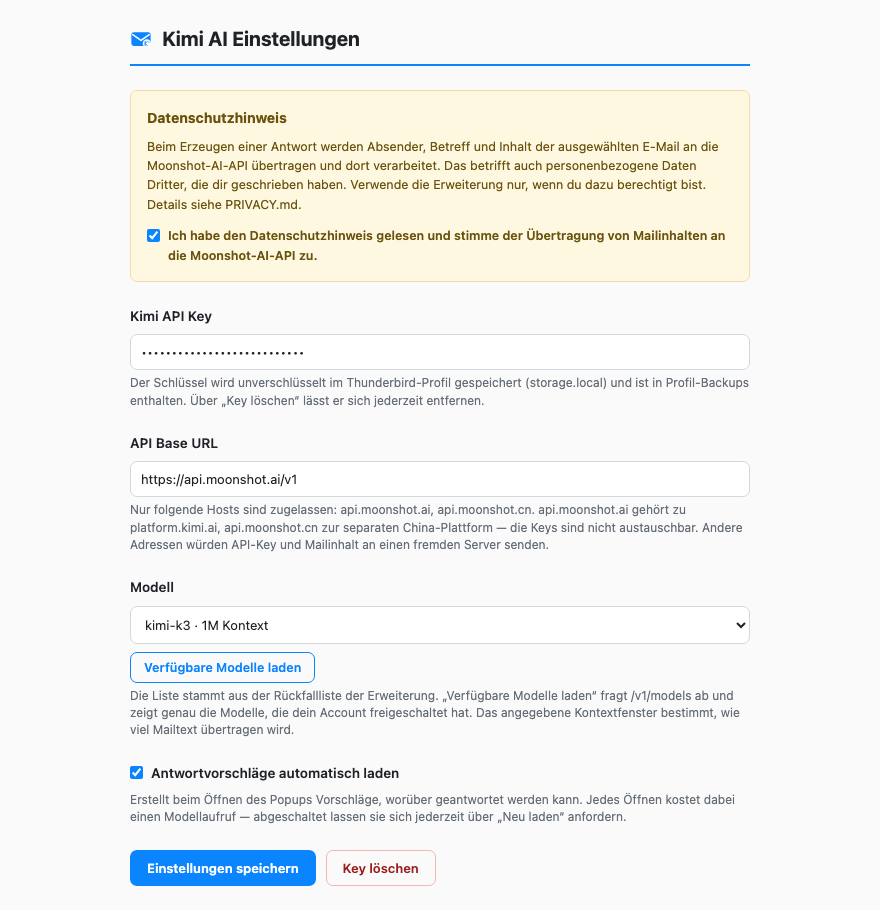
</p>

## Entwicklung

Keine Laufzeitabhängigkeiten. Alles läuft mit Bordmitteln von Node.

```bash
npm run check
```

Führt die Konsistenzprüfungen aus (Manifest gültig, referenzierte Dateien
vorhanden, jede von einem Skript benutzte Element-ID auch im Markup, jeder
i18n-Schlüssel in beiden Sprachen definiert und benutzt) sowie 61 Unit-Tests.

```bash
npm run preview
```

Rendert die Oberfläche im Browser aus denselben HTML- und CSS-Dateien, die das
Add-on ausliefert, mit gestubbtem `browser`-Objekt. Zustände, die man im Betrieb
kaum zu Gesicht bekommt, lassen sich über die Adresszeile schalten — fehlende
Zustimmung, fehlender Key, Vorschläge laden oder scheitern, Mail ohne lesbaren
Textteil, Erzeugen scheitert. `npm run shots` macht daraus die Screenshots oben.

Mehr in [docs/DEVELOPMENT.md](docs/DEVELOPMENT.md); der vollständige Code-Audit
und die manuelle Testcheckliste stehen in [docs/AUDIT.md](docs/AUDIT.md).

### Ehrliche Grenzen

- Ein Modellaufruf pro Klick, kein Streaming.
- Anhänge werden nicht gelesen.
- Verschlüsselte Nachrichten liefern keinen Textteil; das Popup sagt das und
  sperrt den Knopf.
- Das Kontextfenster unbekannter Modelle wird aus der ID geschätzt, nicht abgefragt.
- Der API-Key liegt unverschlüsselt in `storage.local` — Thunderbird bietet
  Erweiterungen keinen geschützten Schlüsselspeicher, und ein lokal
  entschlüsselbares Geheimnis wäre Theater.
- Die DOM-abhängigen Pfade und alles, was Thunderbird-APIs anfasst, sind nicht
  automatisch getestet. Dafür gibt es die manuelle Checkliste in
  [docs/AUDIT.md](docs/AUDIT.md).

## Lizenz

MIT
